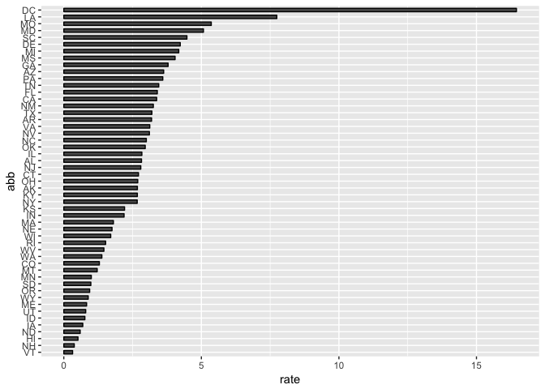

Report on gun murders
================
Casey Grasdal
6/21/2018

Introduction
------------

This is a report on 2010 gun murder rates obtained from FBI reports. The original data was obtained from [this Wikipedia page](https://en.wikipedia.org/wiki/Murder_in_the_United_States_by_state).

We are going to use the following library:

``` r
library(tidyverse)
```

    ## Warning: package 'tidyr' was built under R version 3.4.4

    ## Warning: package 'purrr' was built under R version 3.4.4

    ## Warning: package 'dplyr' was built under R version 3.4.4

and load the data we already wrangled:

``` r
load("rda/murders.rda")
```

Murder rate by state
--------------------

We note the large state to state variability by generating a barplot showing the murder rate by state:

    ## Warning: package 'bindrcpp' was built under R version 3.4.4


